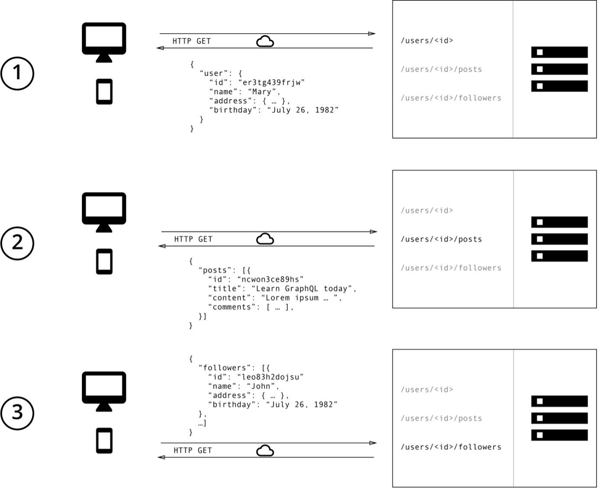
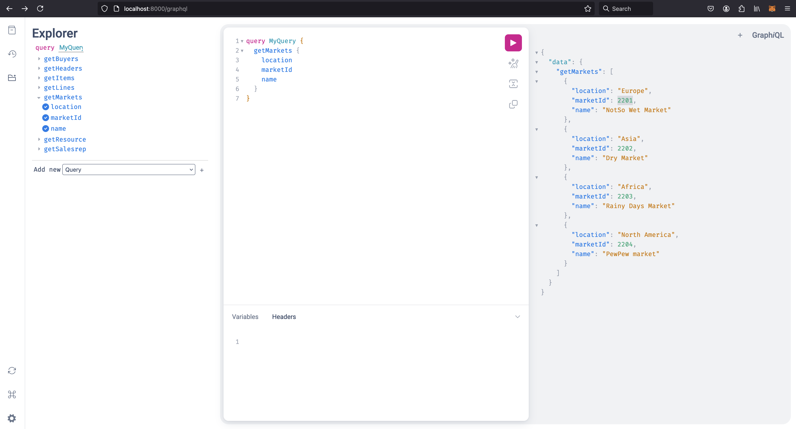

# GraphQL API PoC
Proof of Concept (PoC) showcasing both FastAPI for REST and Strawberry for GraphQL. This example demonstrates how you can implement both approaches in a single project.

[](https://www.python.org/downloads/)
[](https://fastapi.tiangolo.com/)
[](https://graphql.org/)
[](https://pypi.org/project/SQLAlchemy/)
[](https://pypi.org/project/strawberry-graphql/)
[](https://www.postgresql.org/)
[](https://www.sqlite.org/)
[](https://www.mysql.com/de/)
[](https://pypi.org/project/uvicorn/)
[](https://www.docker.com/)

## REST vs. GraphQL
| Feature/Aspect                                  | REST                                                                                           | GraphQL                                                                                       |
|-------------------------------------------------|-----------------------------------------------------------------------------------------------|------------------------------------------------------------------------------------------------|
| Endpoints                                        | Multiple endpoints                                                                             | Single endpoint that takes dynamic parameters                                                   |
| Data Structure Control                           | Controlled by the backend                                                                      | Controlled by the frontend                                                                      |
| Server Type                                      | Stateless servers with structured access to resources                                          | Stateless servers with flexible controlled access to resources                                  |
| Data Format Control                              | Frontend has no control over the structure or format                                            | Frontend specifies the data structure and format it needs                                        |
| API Changes                                      | New or modified APIs needed when data requirements change, leading to longer production times   | No need for API changes for different data requirements, leading to faster iterations            |
| Request Structure                                | Multiple requests for different resources                                                       | Single request in the body with a query specifying all data requirements                         |
| Backend Workload                                 | Requires more backend development to adapt to changing data needs                               | Reduces backend workload by leaving data structure control to the frontend                       |
| Iteration Speed                                  | Slower due to backend dependency on API changes                                                 | Faster iteration and quicker feedback for the business                                           |
| Schema                                           |                        |            | 


### Prerequisites

- Ensure you have Python 3.11 or higher installed.

### Download and Install

1. Clone the repository:

   ```https://github.com/dpedwards/python-graphql-fastapi.git```

2. Change into the project directory:

   ```cd python-graphql-fastapi```

3. Create and activate a virtual environment:

   ```python -m venv venv```
   
   ```source venv/bin/activate```
   #### On Windows, use
   ```venv\Scripts\activate```

5. Install dependencies:

   ```pip install -r requirements.txt```

### Start the API server (FastAPI & GraphQL) with Docker or Uvicorn

#### Docker

Build:

  ```docker compose up```

Rebuild (optional):

  ```docker compose down```

  ```docker compose up --build```

Clean (optional):

  ```docker system prune -a --volumes```

#### Uvicorn
Run the API server with the following command:

   ```uvicorn main:app --reload```

## FastAPI 

### Access the FastAPI Swagger Playground

Visit http://localhost:8000/docs in your browser to access the Swagger documentation and explore available API endpoints.


## GraphQL API

### Access the GraphQL GraphiQL Playground

Visit http://localhost:8000/graphql in your browser to access the GraphQL Playground.



### Examples of GraphQL Queries

#### Get Resource Data

```graphql
query MyQuery {
  getHeaders {
    active
    buyerId
    headerId
    name
    salesRepId
    lines {
      creationDate
      headerId
      itemId
      lineId
      marketId
      name
      items {
        description
        itemId
        name
      }
      markets {
        location
        marketId
        name
      }
    }
    salesRep {
      resourceId
      salesRepId
      resource {
        name
        resourceId
      }
    }
    buyers {
      buyerId
      name
    }
  }
}
```
### Resposnse:

```
{
  "data": {
    "getHeaders": [
      {
        "active": "Y",
        "buyerId": 1003,
        "headerId": 1,
        "name": "Header Name 1",
        "salesRepId": 102,
        "lines": {
          "creationDate": "2023-01-01",
          "headerId": 1,
          "itemId": 701,
          "lineId": 55001,
          "marketId": 2201,
          "name": "Line Name 1",
          "items": {
            "description": "gold",
            "itemId": 701,
            "name": "gold"
          },
          "markets": {
            "location": "Europe",
            "marketId": 2201,
            "name": "NotSo Wet Market"
          }
        },
        "salesRep": {
          "resourceId": 12,
          "salesRepId": 102,
          "resource": {
            "name": "Jaba Maba",
            "resourceId": 12
          }
        },
        "buyers": {
          "buyerId": 1003,
          "name": "Simon Sims"
        }
      },
      {
        "active": "Y",
        "buyerId": 1002,
        "headerId": 2,
        "name": "Header Name 2",
        "salesRepId": 105,
        "lines": {
          "creationDate": "2022-01-05",
          "headerId": 2,
          "itemId": 701,
          "lineId": 55003,
          "marketId": 2203,
          "name": "Line Name 3",
          "items": {
            "description": "gold",
            "itemId": 701,
            "name": "gold"
          },
          "markets": {
            "location": "Africa",
            "marketId": 2203,
            "name": "Rainy Days Market"
          }
        },
        "salesRep": {
          "resourceId": 15,
          "salesRepId": 105,
          "resource": {
            "name": "Viper Song",
            "resourceId": 15
          }
        },
        "buyers": {
          "buyerId": 1002,
          "name": "Bobby DropTable"
        }
      },
    ]
  }
}
```

## Mutation:

```
mutation MyMutation {
  updateHeader(header: {name: "Mutation Update", headerId: 6, salesRepId: 1, buyerId: 2, active: "yes"}) {
    name
    salesRepId
    buyerId
    active
  }
}
```

Result:

```
{
  "data": {
    "updateHeader": {
      "name": "Mutation Update",
      "salesRepId": 1,
      "buyerId": 2,
      "active": "yes"
    }
  }
}
```


### Insert:

```
mutation MyMutation {
  createHeader(
    header: {headerId: 7, name: "TEST", buyerId: 1002, active: "Y", salesRepId: 105}
  ) {
    name
    salesRepId
    buyerId
    active
  }
}
```

Result:

```
{
  "data": {
    "createHeader": {
      "name": "TEST",
      "salesRepId": 105,
      "buyerId": 1002,
      "active": "Y"
    }
  }
}
```

Contact: davain.edwards@statista.com